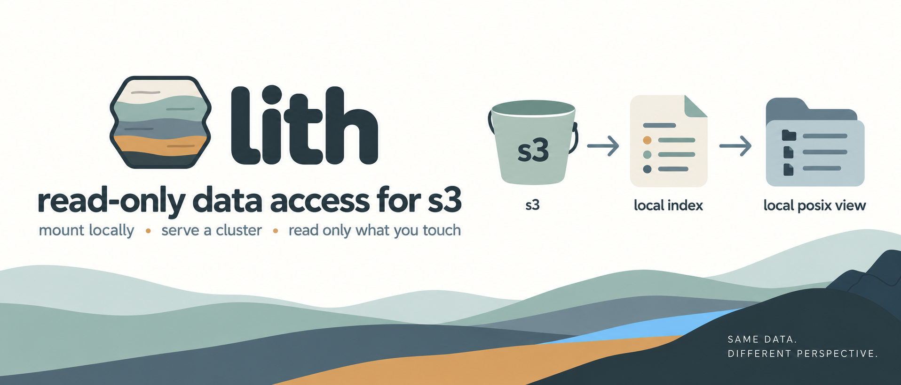

# lith

<p align="center">
  
</p>

Read-only, high-performance POSIX filesystem over an existing S3 bucket in its
native key layout.

`lith` presents any S3 bucket — a Registry of Open Data dataset, a lab bucket,
an instrument dump — as a read-only filesystem, using the bucket's key
namespace directly. It writes nothing to the bucket, needs no sidecar objects,
and serves all metadata (`readdir`, `lookup`, `getattr`, `open`) locally from an
index after a one-time build.

**Why "lith"?** As in *lithic* / *lithology* — rock strata. lith serves a
bucket's objects as read-only strata, exactly as they were laid down: the
bucket's native key layout is the stratum, and lith never rewrites it.

**Read-only by definition — the reason lith exists.** No write path is not a
limitation; it is what buys free local metadata, an index two uncoordinated
readers agree on, handles pinned at open, and a cluster cache that never needs
invalidation. A tool that can write cannot have those; writes are a separate
program.

**Cloud-native by thesis, portable by implementation — why it works.** lith runs
against any S3-compatible endpoint, but its economics come from the cloud:
aggregate bandwidth that grows as readers are added, data that is already in the
store, ephemeral compute, and free durability. *Lustre and GPFS are on-prem
designs running in the cloud; lith is a design that could not have been built
anywhere else.*

Whether lith is for you — and where it is the wrong tool — is
**[What lith is for](https://scttfrdmn.github.io/lith/scope/)**.

## What it is

- **Read-only.** There is no write path. Every mutating operation returns `EROFS`.
- **Native layout.** The bucket's keys *are* the filesystem. Any bucket, any producer.
- **Local metadata.** After an index build, listing and stat make zero S3 calls.
- **Mount any prefix.** Root the filesystem at any prefix below the bucket; one
  prebuilt index backs many prefix mounts at once (`lith umount`/`lith mounts`
  manage them).
- **Prefetch that knows its limits.** A single memory-tier-bounded budget feeds
  per-handle readahead, sibling readahead for chunked stores, a format-aware
  plan (Zarr chunk grid), and parallel parts for mid-size files; the in-flight
  window is sized from the NIC's baseline bandwidth.
- **Fast.** Sequential throughput near NIC line rate; random reads bounded by
  cache hit rate, not S3 request latency.
- A single static Go binary.

## What it is not

- **Not writable.** No writes, ever — not "writes disabled", writes *absent*.
- **Not a re-layout.** It does not own or rewrite the bucket's object format.
- **Linux only.** It relies on FUSE; macOS/Windows are out of scope.

## Install

Download the static binary for your architecture (a stable name that always
points at the latest release):

```
# arm64 (Graviton, Apple-on-Linux VMs, …)
curl -L https://github.com/scttfrdmn/lith/releases/latest/download/lith_linux_arm64 -o lith && chmod +x lith
# or x86-64
curl -L https://github.com/scttfrdmn/lith/releases/latest/download/lith_linux_amd64 -o lith && chmod +x lith
sudo mv lith /usr/local/bin/
```

Versioned `.tar.gz` archives are on the [releases](https://github.com/scttfrdmn/lith/releases)
page. Or, with Go: `go install github.com/scttfrdmn/lith/cmd/lith@latest`.

## Commands

```
lith mount   s3://bucket[/prefix][@current|@<ver>] /mnt/point [flags]  # mount as a read-only filesystem
lith serve   nfs s3://bucket[/prefix][@current] [flags]  # NFSv3 gateway: one node serves a cluster
lith umount  /mnt/point [--all] [--force]              # unmount (SIGTERM, then fusermount fallback)
lith mounts                                            # list live lith mounts (and stale records)
lith refresh /mnt/point                                # hot-swap a @current mount to a newly published version
lith index   build|refresh|inspect s3://bucket[/prefix] --index-file F
lith doctor  [s3://bucket[/prefix][@ref]]              # diagnose whether lith will work here
lith bench   s3://bucket/key --pattern seq|rand4k|stride [--against PATH]
lith version                                            # version, commit, build date
```

## Quick start: a public Registry of Open Data bucket

The `1000genomes` bucket is public; use `--no-sign-request` to read it without
credentials:

```
lith index build s3://1000genomes/changelog_details --index-file /tmp/1kg.lithidx --no-sign-request
lith index inspect /tmp/1kg.lithidx
sudo mkdir -p /mnt/1kg && sudo chown "$USER" /mnt/1kg   # you must own the mountpoint
lith mount  s3://1000genomes/changelog_details /mnt/1kg --index-file /tmp/1kg.lithidx --no-sign-request
ls -l /mnt/1kg
cat /mnt/1kg/changelog_details_20081219
lith umount /mnt/1kg
```

## Documentation

Full docs — how to use lith, when to use it, and when not to — are at
**[scttfrdmn.github.io/lith](https://scttfrdmn.github.io/lith/)**:

- **[Start here](https://scttfrdmn.github.io/lith/)** — five minutes to a first result on a public bucket.
- **[What lith is for](https://scttfrdmn.github.io/lith/scope/)** — whether lith fits, the two-category boundary, and where it is the wrong tool.
- **[Copy or mount?](https://scttfrdmn.github.io/lith/copy-or-mount/)** — the decision, with the measured crossover by access shape.
- **[Sizing the node](https://scttfrdmn.github.io/lith/sizing/)** — NIC, RAM, NVMe, and lith's own CPU cost; the per-class matrix.
- **[Meet a deadline](https://scttfrdmn.github.io/lith/deadline/)** — fan-out: wider is sooner *and* cheaper with a mount.
- **[CargoShip archives](https://scttfrdmn.github.io/lith/cargoship/)** — mounting packed CargoShip 2.1 archives.
- **[Published datasets](https://scttfrdmn.github.io/lith/published-datasets/)** — `@current` pointer mounts and `lith refresh`.
- **[Serving a cluster](https://scttfrdmn.github.io/lith/serving-a-cluster/)** — the NFSv3 gateway: one node serves N.
- **[Running in a container](https://scttfrdmn.github.io/lith/running-in-a-container/)** — the distroless image and the gateway in Kubernetes.
- **[Knobs](https://scttfrdmn.github.io/lith/knobs/)** — every flag, grouped by the trade it makes.

Benchmark data lives in [`bench/results/`](bench/results/); the S3 client
ceiling can be reproduced independently with `cmd/lith-s3bench`.

## Testing

Unit tests run with the race detector and touch no network:

```
make test
```

An optional end-to-end test runs only when `LITH_E2E_BUCKET` is set. It builds
an index from a real public prefix and asserts a known key resolves. It is
verified against `s3://1000genomes/changelog_details` (key
`changelog_details_20081219`):

```
LITH_E2E_BUCKET=1000genomes LITH_E2E_PREFIX=changelog_details go test ./internal/index/ -run E2E -v
```

## License

Apache-2.0. Copyright 2026 Scott A Friedman.
