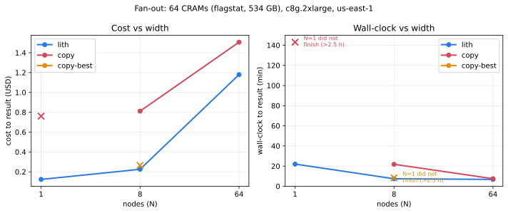

# Meet a deadline

You have more work than one node can finish in time. Go wider.

## Mount beats copy at every width

The claim to test: mounting lets you go wider without the data-plane cost that
copying pays per node. Measured — `flagstat` over 64 CRAMs (535 GB) across 1, 8,
and 64 `c8g.2xlarge` spot nodes, lith-mount vs stage-to-gp3
([#83](https://github.com/scttfrdmn/lith/issues/83)):



**lith is both cheaper and faster than copying at every width.** At **N=1**, one
node finishes the whole job through lith in **22 min for $0.12**, while the copy
path **can't even finish staging** the 535 GB in the 2.5-hour budget (its stage
alone, ~72 min, exceeds lith's entire run). At the **sweet spot N=8** — where the
file count matches the cores, so every vCPU is busy — lith is **2.9× faster and
3.6× cheaper** (7.4 min / $0.23 vs 21.8 min / $0.81). Copying pays for staging
lith never does — serial in front of compute, then read back from a 125 MB/s
volume — so it loses on both axes, everywhere.

Two honest caveats the chart shows. **Cost is not flat across width:** it rises
with N for *both* paths, because a fixed per-node boot-and-setup cost is paid N
times and, past the sweet spot, each node underuses its cores (at N=64 each node
runs one `flagstat` on 8 vCPUs). And **wall-clock floors** once you pass
N ≈ files ÷ vCPUs: from 8 to 64 nodes the wall barely moved while cost grew ~5×.

So the rule for going wide: **fan out to about `files ÷ vCPUs-per-node`, not
further.** There you get full CPU utilization, the shortest wall-clock, cost near
its floor — and lith's staging-free advantage over copying at its largest. Wider
than that spends more for no speed-up; copying loses at any width.

## How to do it

Fan out with an instance array, one lith mount per node, each node reading its
own shard by key range. No shared state, so nothing coordinates and nothing
contends:

```bash
# One node's job, parameterized by shard index (0..N-1) of N.
# The index defines a key range; the node mounts and processes only its shard.
lith mount s3://your-bucket/dataset /mnt/data \
  --index-file /tmp/dataset.lithidx --daemon
process-shard /mnt/data --shard "$SHARD_INDEX" --of "$N_SHARDS"
fusermount3 -u /mnt/data
```

Launch N of them as an array (e.g. `spawn array`), each with its own
`SHARD_INDEX`. Points that make this cheap and safe:

- **Shard by key range, not by copy.** Each node's `process-shard` walks the
  keys assigned to its index. lith serves every node's metadata from the local
  index and fetches only the objects that node reads.
- **No shared filesystem.** There is nothing to provision, size, or tear down
  between the nodes; each mount is independent and local to its node.
- **Spot-safe.** Nothing durable lives on the node — no staged copy to lose — so
  a reclaimed spot instance costs only its in-flight shard, which the array
  reschedules. This is what makes width cheap: you can run the whole fan-out on
  interruptible capacity.
- **Build the index once, reuse it N times.** Build the `--index-file` in the
  launcher and hand the same file to every node (or let each node auto-build for
  a small prefix); the listing cost is paid once, not per node.

Prebuild the index in your launcher, distribute it with the job, and each node
starts reading immediately with zero metadata round-trips.

See your spore.host cookbook's **job-arrays** pattern for the launcher side
(array submission, per-index parameters, spot retries).
<!-- link: cookbook job-arrays URL pending -->
